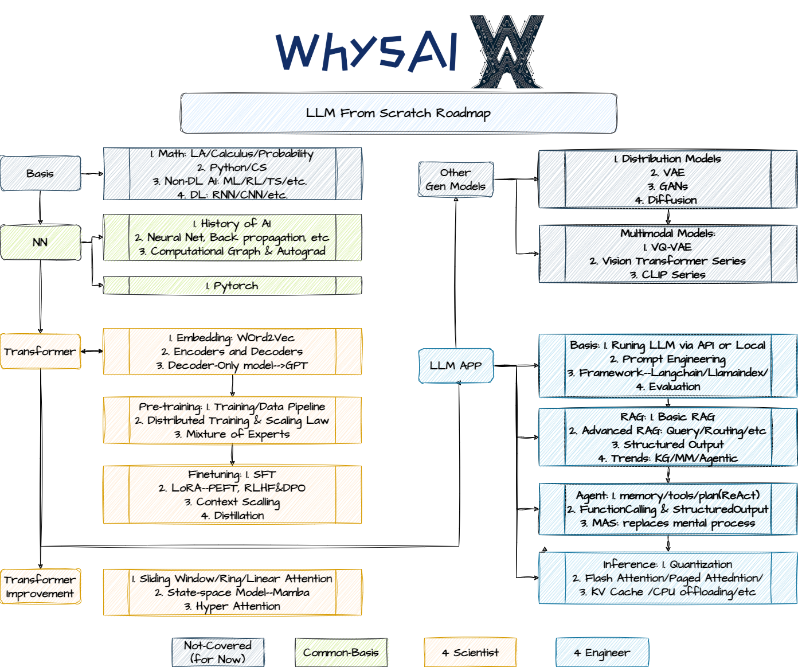

### Description

WhysAI--**LLMFS**项目是由一系列mini-projects组成、围绕大模型主题的系列课程。主要包括三个系列：

1. [CB](https://github.com/LloydS827/WhysAI-LLMFS-CB)：深度学习基础，包括神经网络、反向传播、PyTorch等；
2. [4S](https://github.com/LloydS827/WhysAI-LLMFS-4S)：以从零到一训练/微调大语言模型为核心；
3. [4E(This Repo)](https://github.com/LloydS827/WhysAI-LLMFS-4E)：以LLM应用为核心，涵盖RAG、Agent、MAS、Inference等。

本项目受到许多优秀的开源课程与资料启发，制作的课程资料包括Slides、Code、Video等，既用来记录学习现代人工智能技术的过程，又希望与大家共同探索AI技术的最佳学习路径。

### 4E(For Engineer)系列课程内容（V0.1, 持续更新中）
| Theme & Contents          | Course Code & Materials | Project & Keywords | Videos | References                                                   |
| ------------------------- | ----------------------- | ------------------ | ------ | ------------------------------------------------------------ |
| 1. Basis                  |                         |                    |        | 1. [datawhalechina/llm-cookbook: 面向开发者的 LLM 入门教程，吴恩达大模型系列课程中文版 (github.com)](https://github.com/datawhalechina/llm-cookbook) 2. [LangChain Master Class For Beginners 2024 [+20 Examples, LangChain V0.2] - YouTube](https://www.youtube.com/watch?v=yF9kGESAi3M&t=72s) 3. [LangChain 101 Course (updated 2024 with LCEL). LangChain 101 course sessions. All code… \| by Ivan Reznikov \| Medium \| Medium](https://medium.com/@ivanreznikov/langchain-101-course-updated-668f7b41d6cb) 4. [Tutorials \| 🦜️🔗 LangChain](https://python.langchain.com/v0.2/docs/tutorials/) 5. [Conceptual guide \| 🦜️🔗 LangChain](https://python.langchain.com/v0.2/docs/concepts/) 6. [langchain源码剖析系列课程_哔哩哔哩_bilibili](https://www.bilibili.com/video/BV1fF41197XT/?spm_id_from=333.999.0.0&vd_source=11cbe4e223f3ef3e00cac82a0cb79098) 7. https://gitee.com/acedar/langchain-anal.git 8.[(85 封私信 / 80 条消息) aC大 - 知乎 (zhihu.com)](https://www.zhihu.com/people/luo-xie-piao-meng/posts?page=2) 9. [Mesop, Streamlit, Chainlit, and Gradio: A Comprehensive Comparison of AI Application Frameworks (ai-hive.net)](https://www.ai-hive.net/post/mesop-streamlit-chainlit-and-gradio-a-comprehensive-comparison-of-ai-application-frameworks) |
| 2. RAG                    |                         |                    |        |                                                              |
| 3. Agent                  |                         |                    |        |                                                              |
| 4. Inference Optimization |                         |                    |        | 1. [Introduction to On-Device AI - DeepLearning.AI](https://www.deeplearning.ai/short-courses/introduction-to-on-device-ai/) |
### Key Resources

>每期参考/推荐资料见“课程内容”

**Key Roadmap & Resources:**

- [GenAI Handbook (genai-handbook.github.io)](https://genai-handbook.github.io/)
- [https://github.com/mlabonne/llm-course](https://github.com/mlabonne/llm-course)
- [karpathy/LLM101n: LLM101n: Let's build a Storyteller (github.com)](https://github.com/karpathy/LLM101n)

**Important：**
- [StatQuest](https://space.bilibili.com/3546620985608836?spm_id_from=333.337.0.0)
- Deeplearning.ai
- Andrej Karparthy: Zero 2 Hero Series
- 3B1B: NN series
- VisualizeML(Iris Series)

**Others**：

- AI Infrastructure [https://github.com/chenzomi12/AISystem/](https://github.com/chenzomi12/AISystem/)
- ML-data engineering [https://github.com/GokuMohandas/Made-With-ML](https://github.com/GokuMohandas/Made-With-ML)
- NN-deeplearning [https://zh.d2l.ai/](https://zh.d2l.ai/)
- Math & Python & ML [https://github.com/Visualize-ML](https://github.com/Visualize-ML)
- AI Papers w/ code [https://github.com/labmlai/annotated_deep_learning_paper_implementations](https://github.com/labmlai/annotated_deep_learning_paper_implementations
- Rag From Stratch by langchain: [https://github.com/langchain-ai/rag-from-scratch](https://github.com/langchain-ai/rag-from-scratch)
- Qwen Docs: [https://qwen.readthedocs.io/zh-cn/latest/index.html#](https://qwen.readthedocs.io/zh-cn/latest/index.html#)
- the bitter lesson: [https://cloud.tencent.com/developer/article/2119875](https://cloud.tencent.com/developer/article/2119875)
- [datawhalechina/llm-cookbook: 面向开发者的 LLM 入门教程，吴恩达大模型系列课程中文版 (github.com)](https://github.com/datawhalechina/llm-cookbook)
- langchain master class: [hw_dungeonrooms4q_h_en_115 (youtube.com)](https://www.youtube.com/watch?v=yF9kGESAi3M)

**Fundalmentals**

1. Python: [30 days of Python](https://github.com/Asabeneh/30-Days-Of-Python)
2. Math & Machine Learning:[Visualize-ML (Iris Series)](https://github.com/Visualize-ML)
3. Deep Learning: [D2l](https://courses.d2l.ai/zh-v2/)

### WhysAI

WhysAI由复旦大学几位在读博士发起，希望通过持续探索，来迈向卓越。Learn all we can，do the experiments，embrace the failures，then succeed。同时，欢迎关注公众号“WhysAI怀思智合”。

